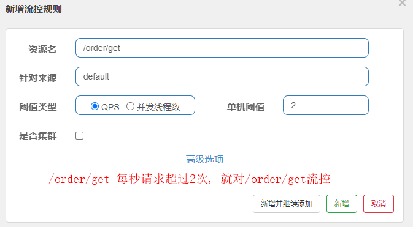
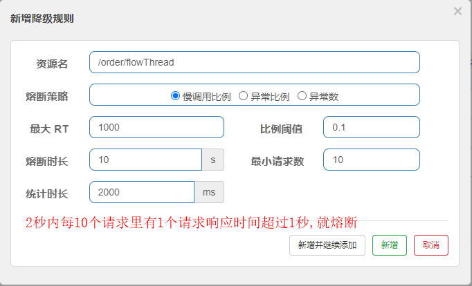
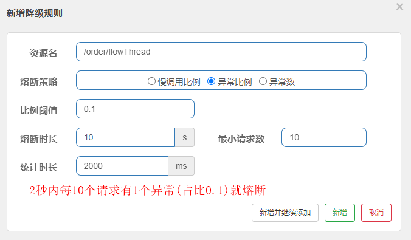
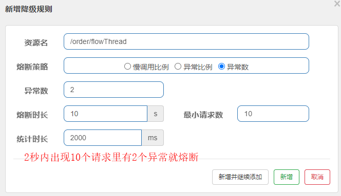

## 一.流量控制

### 1.Sentinel流控规则使用(入门)

1. 引入sentinel 核心依赖和注解支持依赖(原生依赖, 可以只用springcloud的starter)

   ```xml
   <!--        sentinel核心库-->
           <dependency>
               <groupId>com.alibaba.csp</groupId>
               <artifactId>sentinel-core</artifactId>
           </dependency>
   <!--        使用@SentinelResource注解需要引入这个依赖-->
           <dependency>
               <groupId>com.alibaba.csp</groupId>
               <artifactId>sentinel-annotation-aspectj</artifactId>
           </dependency>
   ```

2. 注册bean, SentinelResourceAspect

   ```java
   @Bean
    public SentinelResourceAspect sentinelResourceAspect(){
        return new SentinelResourceAspect();
    }
   ```

3. 定义资源, 设置流控降级后的处理方法

   ```java
   //配置规则
   @PostConstruct
   private static void initFlowRules() {
       //后续不会通过代码的方式设置规则
       List<FlowRule> rules = new ArrayList<>();
       FlowRule rule = new FlowRule();
       //针对资源进行限制
       rule.setResource(RESOURCE_NAME);
       rule.setGrade(RuleConstant.FLOW_GRADE_QPS);
       // Set limit QPS to 20.
       rule.setCount(1);
       rules.add(rule);
   }
   ```

   ```java
   /**
    * @SentinelResource 改善接口中资源定义和被流控降级后的处理方法
    * value:定义资源
    * blockHandler: 流控降级后的处理方法(默认要在同一个类里)
    * 不想在同一个类里用blockHandlerClass
    * fallback 接口出现异常, 交给指定的方法处理
    */
   @SentinelResource(value = USER_RESOURCE_NAME, blockHandler = "blockHandlerForGetUser")
   @GetMapping("/user")
   public User getUser(String id){
       return new User("1", "jerry", 10);
   }
   
   
   /**
    * 注意:
    * 1. 修饰符一定要public
    * 2. 返回值要和源方法保证一致, 包含源方法的参数, 流控后也能正确返回信息给用户
    * 3. 可以在参数后添加BlockException, 可以区分是什么规则的处理方法
    * 官网对该注解有详细的说明
    * @return
    */
   public User blockHandlerForGetUser(String id, BlockException ex){
       ex.printStackTrace();
       return new User(null, "流控!", null);
   }
   ```

### 2.Sentinel熔断规则

熔断后会过一段时间会进入半开状态, 半开状态第一次请求异常直接熔断, 不需要根据规则判断

原生代码配置示例:

```java
//设置降级规则 异常数策略
ArrayList<DegradeRule> degradeRules = new ArrayList<>();
DegradeRule degradeRule = new DegradeRule();
degradeRule.setResource(DEGRATE_RESOURCE_NAME);
//设置规则, 异常数
degradeRule.setGrade(RuleConstant.DEGRADE_GRADE_EXCEPTION_COUNT);
//阈值
degradeRule.setCount(2);
//触发熔断的最小请求数
degradeRule.setMinRequestAmount(2);
//统计时长, 默认1秒, (一秒内请求两次触发了两次异常就触发熔断)
degradeRule.setStatIntervalMs(60*1000);
//熔断持续时长 10秒
//触发了熔断, 再次请求就会直接调用降级方法
//过了10秒后进入半开状态, 如果第一次请求异常, 直接熔断
degradeRule.setTimeWindow(10);

degradeRules.add(degradeRule);
DegradeRuleManager.loadRules(degradeRules);
```

### 3.Spring Cloud Alibaba整合Sentinel

1.引入依赖, sentinel版本需适配SpringCloud对应版本, [官方详细版本对应关系](https://github.com/alibaba/spring-cloud-alibaba/wiki/%E7%89%88%E6%9C%AC%E8%AF%B4%E6%98%8E)

```xml
<dependency>
    <groupId>com.alibaba.cloud</groupId>
    <artifactId>spring-cloud-starter-alibaba-sentinel</artifactId>
    <version>2.2.1.RELEASE</version>
</dependency>
```

2.启动sentinel-dashboard-xxx.jar包, [github Releases](https://github.com/alibaba/Sentinel/releases)

​	默认端口8080, 用户名密码sentinel, 可自行设置, 启动bat脚本示例:

```cmd
java -Dserver.port=8088 -Dsentinel.dashboard.auth.username=honma -Dsentinel.dashboard.auth.password=honma -jar sentinel-dashboard-1.8.3.jar
pause
```

3.配置主配置文件

```xml
spring:
  application:
    name: order-sentinel
  cloud:
    sentinel:
      transport:
        dashboard: 127.0.0.1:8080
```

### 4.流控规则

#### 流控模式

​	1.直接: QPS超过阈值对该服务流控



​	2.关联: 一个服务的QPS超过阈值, 对另一个服务流控


​	3.链路: 对方法进行流控, 不只是针对一个接口

#### 流控效果

 1. 快速失败: 默认

 2. Warm up:

    ​	预热模式, 系统冷却一段时间后, 突然有大量访问(激增流量), 此时缓存还未创建, 为避免大量请求同时落到数据库导致系统崩溃, 让QPS慢慢递增

 3. 排队等待:

    ​	应对脉冲流量(洪峰流量跟空闲交替), 处理间隔性突发流量, 让请求排队执行,把空闲时间利用起来 


### 5.熔断降级规则

​	用于不稳定的弱依赖服务, 避免因弱依赖服务不稳定而影响整个系统(服务雪崩)


#### 	熔断策略

​	慢调用比例:	响应慢的请求到一定的比例就对服务熔断



​	异常比例:	



​	异常数:



​	