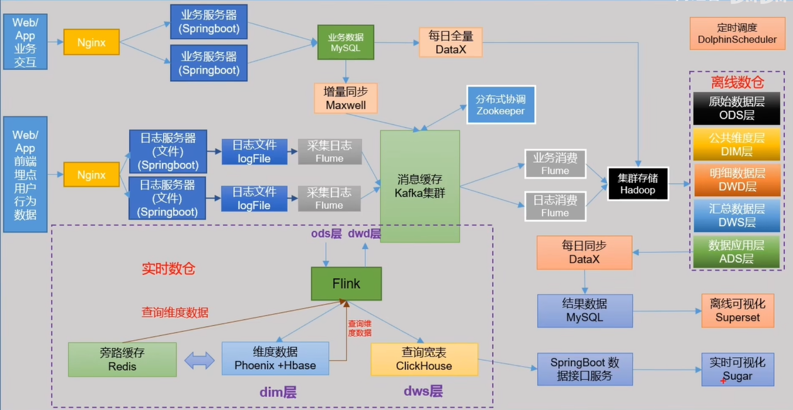

## 一、数据仓库简述

数据分类：**业务数据**用mysql等数据库，**用户行为数据**用日志文件存储，爬虫数据

数据采集到HDFS：用户行为数据用Flume，业务数据用DataX

数据分析：ODS→DWD→DWS→ADS

ODS：备份

DWD：数据清洗（脱敏等等）

DWS：预聚合

ADS：统计最终指标

数据输出：报表系统（可视化），用户画像（给用户打标签），推荐系统（机器学习）

二、项目需求分析

1、采集平台

（1）用户行为数据采集平台搭建

（2）业务数据采集平台搭建

2、技术选型

​	数据采集传输：Flume，Kafka，DataX，Maxwell，Sqoop，Logstash

​	数据存储：MySQL，HDFS，HBase，Redis，MongoDB

​	数据计算：Hive，Spark，Flink，Storm，Tez

​	数据查询：Presto，Kylin，Impala，Druid，ClickHouse，Doris

​	数据可视化：Superset，Echarts，Sugar，QuickBI，DataV

​	任务调度：DolphinScheduler，Azkaban，Qozie，Airflow

​	集群监控：Zabbix，Prometheus

​	元数据管理：Atlas

​	权限管理：Ranger，Sentry

三、系统数据流程

## 二、用户行为数据采集

