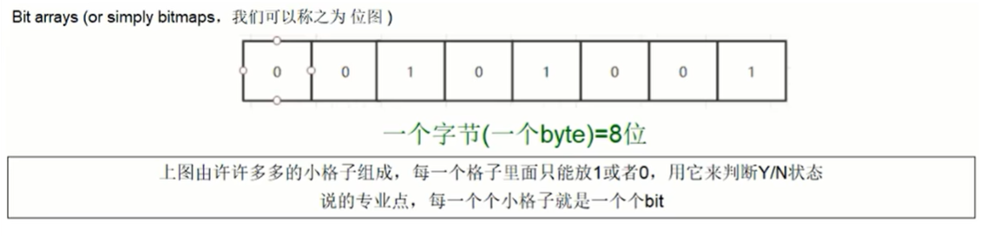

# Redis

Remote Dictionary Server

## 安装

相关工具：

redis-benchmark：性能测试工具

redis-check-aof：修复有问题的AOF文件，rdb和aof后面讲

redis-check-dump：修复有问题的dump.rdb文件

redis-cli：客户端，操作入口

redis-sentinel：redis集群使用

redis-sentinel：redis集群使用

redis-server：Redis服务器启动命令

注：有外网的服务器redis一定要设置密码，不然会被入侵挖矿

Linux用install安装redis默认路径

redis.config: /etc/redis/redis.conf

dump.rdb: /var/lib/redis/dump.rdb

#### **redis-config配置**

daemonize no	改为 daemonize yes（以守护进程后台运行）

protected-mode yes	改为 protected-mode no（保护模式关闭）

bind 127.0.0.1	默认只能本地访问，注释掉或改成本机ip地址

添加redis密码	requirepass foobared改成要设置的密码

## Redis数据类型

**String**：String是二进制安全的，可以存jpg图片或序列号对象，String类型的value最多可以是512M

**List**

**Hash**

**Set**

**ZSet**

其他：

​	GEO：地理空间

​	HyperLogLog：基数统计（不重复数据的的统计，例当天所有ip的访问量统计），HyperLogLog只需12KB内存就可以计算2^64不同元素的基数（不存储元素本身）

​	bitmap：位图

​		

​	bitfield：位域

​	Stream：流，用于消息队列，Redis支持发布订阅（pub/sub）实现消息队列，但没办法持久化，Stream提供了消息的持久化和主备复制功能，可以让客户端访问任意时刻的数据，记住每个客户端访问的位置

## 常用命令

命令查阅：https://redis.io/commands/

## 面试

### 1、redis数据类型

​	String、Hash、List、Set、Zset

### 2、redis主要功能

​	缓存、Pub/Sub(发布订阅)、消息队列

### 3、缓存时什么，为什么要用环境

​	缓存是临时存储的数据，一般存放在读取数据很快的存储介质，用于快速数据存取用空间换时间，一些需要频繁读取的数据如果每次都要用磁盘、数据库或网络需要消耗资源，增加耗时。

### 4、redis持久化（RDB & AOF）

### 5、redis集群架构

#### 1）主从模式

问题思考：

​	如果从节点内存小于主内存，在缓存数据同步到从节点时，从节点内存不足了，会发生什么？

​	答：与配置有关系

​		1是配置了淘汰策略，比如LRU（Least recently used ），会淘汰数据；NoEviction策略： 如果Redis配置为使用`maxmemory-policy noeviction`，redis会挂起写操作，知道有足够的内存使用

​		2是数据都是永不淘汰，可能会导致redis崩溃挂点；如果直接部署在linux上，不是容器部署、没有限制redis内存使用，操作系统可能会发生内存交换（swapping）把内存的数据写到磁盘里，导致性能下降，操作系统的OOM Killer可能会终止redis进程

#### 2）Sentinel模式（哨兵模式）

​	哨兵节点至少有3个，并且节点数量最好是单数

**选举流程**

​	-- 主节点挂掉

​	-- 半数以上哨兵节点检测到主节点挂掉

​	-- 其中一个哨兵节点发起选举投票

​	-- 一个哨兵节点得到半数哨兵节点以上票数，广播成为主节点，其他节点更改配置该节点未主节点

#### 3）官方Cluster模式（分片技术）

**组群过程**

​	检测到有新节点加入，发送CLUSTER MEET （CLUSTER MEET <ip> <port>）命令邀请节点加入集群

**分片原理**

哈希槽（slots）划分

​	划分成2的14次方(16383 )个槽位，每个节点处理范围内的槽位数据

哈希槽映射

​	用CRC16的算法计算key得到一个16bit的值，把这个值用16383取模，得到0~16383范围内的值，映射到对应的槽位

client访问集群的过程

​	client会把slots和节点映射关系缓存到本地，在本地通过CRC16计算结果对16383取模得到slots位置，定位到数据所在的节点。

**数据复制过程**

**故障转移**

参考文章：https://www.cnblogs.com/wzh2010/p/15886799.html

